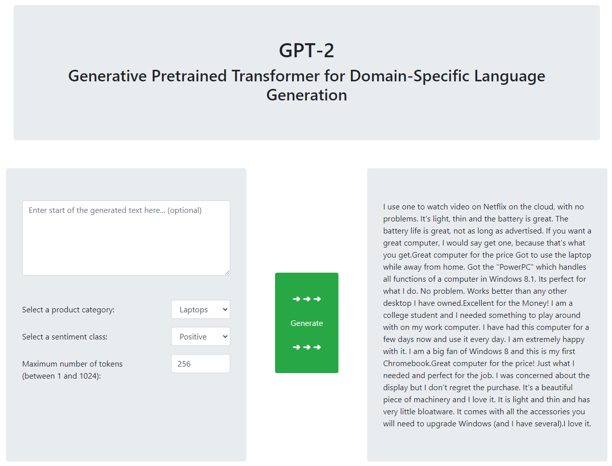
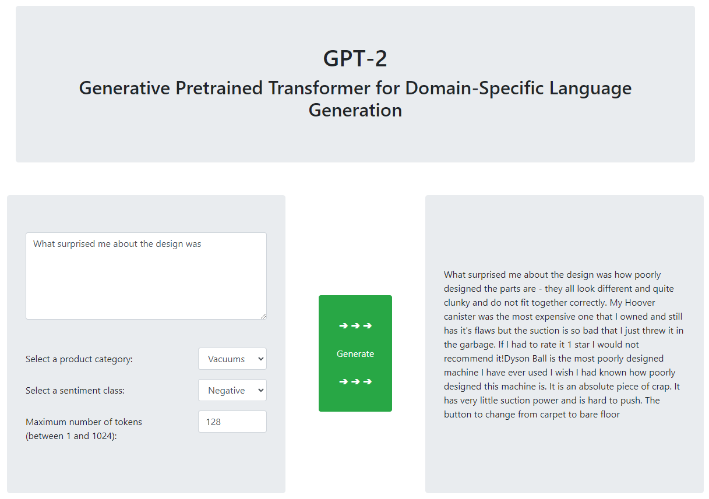

## GPT-2 for Domain-Specific Language Generation

Small application to test out some functionality of OpenAIs [Generative Pre-Trained Transformer (GPT-2)](https://github.com/openai/gpt-2) Model.

A total of 10 Language Generation models are trained (fine-tuned) on product reviews from the [Amazon Review Dataset](https://nijianmo.github.io/amazon/index.html), each 
combination of the five product categories `Laptops`, `Cell Phones`, `Mens Running Shoes`, `Vacuums`, `Plush Figures` and two
sentiment classes (`positive` = 5 star rating, `negative` = 1 or 2 star rating). For each of those a sample with a size of 30.000 reviews is used to fine-tune the pre-trained GPT-2 model.

The model training and generation is done using the wrapper [simpletransformers](https://simpletransformers.ai/) which uses [huggingface](https://huggingface.co/).

The frontend and routing is implemented in [Flask](https://flask.palletsprojects.com), using [Jinja](https://jinja.palletsprojects.com) as Template Engine for rendering the HTML and [Bootstrap](https://getbootstrap.com/) for the frontend design.

 

### Examples of generated texts

##### Laptops, positive, random start:

<kbd></kbd>

 

##### Vacuums, negative, manually set start:

<kbd></kbd>

 

### Requirements

##### - Python >= 3.8

##### - Conda
  - `pytorch==1.7.1`
  - `cudatoolkit=10.1`

##### - pip
  - `simpletransformers`
  - `ijson`
  - `tqdm`
  - `flask`

 

### Notes

The uploaded versions of the training data in this repository are cut off after the first 50 rows of each file, the 
real training data contains a combined ~270.000 rows. The trained model files `pytorch_model.bin` for each model are omitted in this repository.
